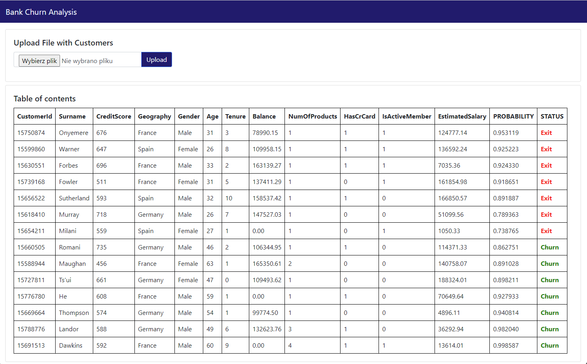
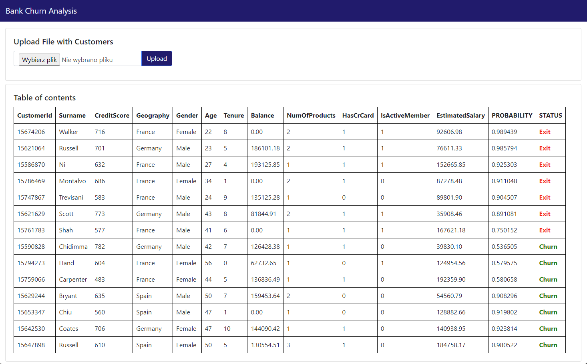
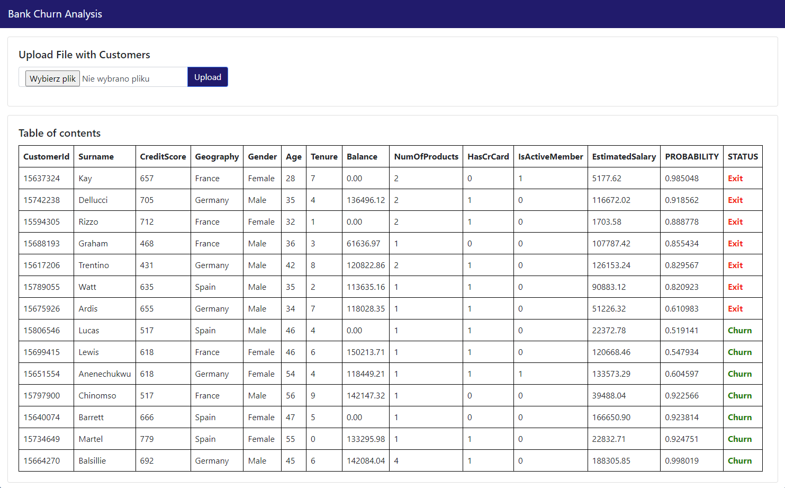

# Banking customer churn predictor (Neural Network)

This project aims to predict customer churn in the banking industry using a neural network model. Customer churn refers to the phenomenon where customers discontinue their relationship with a business or service provider. Predicting churn can be crucial for businesses to take proactive measures in retaining customers and minimizing revenue loss.


## Neural Network Model

The project utilizes a neural network model to predict customer churn. The model is designed to learn patterns and relationships in the data, allowing it to make accurate predictions based on the given input features.

The neural network architecture consists of an input layer, seven hidden layers, and an output layer. Each layer consists of 6 neurons that perform computations and pass information forward through weighted connections. The model is trained using backpropagation and optimization techniques to minimize prediction errors and improve accuracy.

## Schema


## Installation

1. Clone the repository:

   ```bash
   git clone https://github.com/jpkrajewski/ANN-banking-customer-churn.git
   ```

2. Run Docker-Compose

   ```bash
   cd ANN-banking-customer-churn; docker compose up --build
   ```

3. Go to **localhost:8000**

## Results

The results of the churn prediction, including the probability of churn and the exit status, are as follows:

The **PROBABILITY** column shows the probability of churn predicted by the neural network model. The higher the probability, the more likely it is for the customer to churn. The **STATUS** column indicates whether the customer has exited or not, based on a chosen threshold.

These results can be utilized by businesses to identify customers who are at a higher risk of churn and take appropriate measures to retain them.






